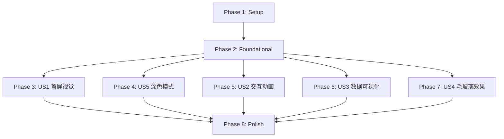

# Tasks: iOS 风格视觉改版

**Feature Branch**: `003-ios-visual-redesign`  
**Spec**: [spec.md](./spec.md) | **Plan**: [plan.md](./plan.md) | **Research**: [research.md](./research.md)  
**Date**: 2025-11-15

## 任务概览

本文档包含 iOS 风格视觉改版的完整实施任务清单。任务按用户故事组织，每个用户故事可独立实施和测试，支持渐进式交付。

- **总任务数**: 85 个
- **用户故事**: 5 个（P1: 2个, P2: 2个, P3: 1个）
- **并行机会**: 约 60% 的任务可并行执行
- **MVP 范围**: Phase 3 (用户故事 1) + Phase 4 (用户故事 5)

---

## Phase 1: Setup（环境准备）

**目的**: 安装新依赖并验证项目环境

- [x] T001 安装 `expo-blur` 库：`npx expo install expo-blur`
- [x] T002 安装 `expo-haptics` 库：`npx expo install expo-haptics`
- [x] T003 [P] 验证 `react-native-reanimated` 版本 ≥3.10.1（已安装）
- [x] T004 [P] 验证 `@gorhom/bottom-sheet` 版本 ≥4.6.4（已安装）
- [x] T005 验证 Expo Go 预览正常（启动开发服务器测试）

---

## Phase 2: Foundational（基础设施）

**目的**: 建立主题系统基础和工具函数，所有用户故事依赖此阶段

**⚠️ 关键**: 此阶段完成前，不能开始任何用户故事实施

### 主题系统扩展

- [ ] T006 [P] 创建 `src/theme/shadows.ts` 定义浅色/深色阴影系统（包含 none, sm, md, lg）
- [ ] T007 [P] 创建 `src/theme/animations.ts` 定义动画配置（duration, easing, spring）
- [ ] T008 [P] 调整 `src/theme/colors.ts` 深色模式配色（验证已符合 iOS 标准）
- [ ] T009 [P] 调整 `src/theme/spacing.ts` 移除旧 shadow 定义（已迁移到 shadows.ts）

### TypeScript 类型定义

- [ ] T010 [P] 创建 `src/types/theme.ts` 扩展主题类型（ExtendedTheme, Shadows, Animations, BlurMaterial）
- [ ] T011 [P] 更新 `src/hooks/useTheme.ts` 返回扩展主题（添加 shadows, animations）

### 工具函数

- [ ] T012 [P] 创建 `src/utils/accessibility.ts` 实现 `shouldDisableBlur()` 检测"减少透明度"设置
- [ ] T013 [P] 创建 `src/utils/performance.ts` 实现 `usePerformanceMonitor()` 检测运行时 FPS
- [ ] T014 [P] 创建 `src/hooks/useHaptics.ts` 封装触觉反馈逻辑（triggerLight, triggerMedium, triggerSuccess, triggerWarning）

### 基础测试（TDD - 测试先行）

- [ ] T015 [P] 编写 `__tests__/theme/shadows.test.ts` 测试阴影配置（验证不透明度、模糊半径范围）
- [ ] T016 [P] 编写 `__tests__/theme/animations.test.ts` 测试动画配置（验证时长、弹簧参数）
- [ ] T017 [P] 编写 `__tests__/theme/colors.test.ts` 对比度测试（WCAG AA 标准 ≥4.5:1）
- [ ] T018 [P] 编写 `__tests__/hooks/useTheme.test.ts` 测试主题切换逻辑
- [ ] T019 [P] 编写 `__tests__/hooks/useHaptics.test.ts` 测试触觉反馈 Hook（模拟 iOS 平台）

### 实施基础设施

- [ ] T020 实施 `src/theme/shadows.ts`（浅色模式：不透明度 0.08/0.12/0.16，深色模式：0.3/0.4/0.5）
- [ ] T021 实施 `src/theme/animations.ts`（fast: 200ms, normal: 350ms, slow: 500ms, spring: damping 20）
- [ ] T022 实施 `src/types/theme.ts`（定义 ShadowStyle, Animations, BlurMaterial 等类型）
- [ ] T023 实施 `src/hooks/useTheme.ts` 扩展版本（合并 shadows 和 animations 到返回值）
- [ ] T024 实施 `src/utils/accessibility.ts`（调用 `AccessibilityInfo.isReduceTransparencyEnabled()`）
- [ ] T025 实施 `src/hooks/useHaptics.ts`（封装 `expo-haptics` API，仅 iOS 平台触发）
- [ ] T026 验证所有基础测试通过（`npm test -- shadows animations colors useTheme useHaptics`）

**Checkpoint**: 基础设施就绪 - 主题系统、工具函数、测试框架完成，用户故事可并行开始 ✅

---

## Phase 3: 用户故事 1 - 首屏视觉焕新体验 (Priority: P1) 🎯 MVP

**目标**: 用户打开应用时，立即看到 iOS 风格的卡片设计、柔和圆角、轻量阴影、8pt 网格间距

**独立测试**: 启动应用 → 查看交易列表 → 截图对比（验证圆角 12pt、阴影参数、间距符合 8pt 网格）

### 测试（TDD - 先编写测试）

- [ ] T027 [P] [US1] 编写 `__tests__/components/ui/Card.test.tsx` 快照测试（新样式：圆角 12pt、阴影 md）
- [ ] T028 [P] [US1] 编写 `__tests__/components/features/ExpenseListItem.test.tsx` 快照测试（卡片布局、间距验证）
- [ ] T029 [P] [US1] 编写 `__tests__/screens/list.test.tsx` 列表渲染测试（验证 FlatList、间距一致性）

### UI 组件视觉更新

- [ ] T030 [P] [US1] 更新 `src/components/ui/Card.tsx`：使用 `spacing.borderRadius.lg` (12pt)、应用 `shadows.md`
- [ ] T031 [P] [US1] 更新 `src/components/ui/Button.tsx`：使用 `spacing.borderRadius.md` (8pt)、添加触觉反馈 `useHaptics().triggerLight()`
- [ ] T032 [P] [US1] 更新 `src/components/ui/Input.tsx`：调整边框圆角为 8pt、边框颜色使用 `colors.border`

### Feature 组件视觉优化

- [ ] T033 [US1] 更新 `src/components/features/ExpenseListItem.tsx`：
  - 应用 Card 组件新样式
  - 调整分类图标为 48x48pt 圆形（使用 `borderRadius.full`）
  - 金额文字字重改为 700（`fontWeight.bold`）、使用 Tabular Nums
  - 时间戳颜色改为 `colors.textTertiary`
- [ ] T034 [US1] 更新 `app/(tabs)/list.tsx`：
  - 验证 FlatList `renderItem` 使用更新后的 ExpenseListItem
  - 调整列表项间距为 `spacing.sm` (8pt)
  - 验证 Safe Area 布局正确

### 深色模式适配

- [ ] T035 [P] [US1] 验证深色模式卡片背景色为 `colors.card` (#1C1C1E)
- [ ] T036 [P] [US1] 验证深色模式阴影使用 `shadows.dark.md`（不透明度 0.4）
- [ ] T037 [P] [US1] 测试浅色/深色模式快速切换（无闪烁、动画平滑）

### 性能与质量

- [ ] T038 [US1] 使用 React Native Profiler 验证列表滚动 ≥60fps（iPhone 12 或更新设备）
- [ ] T039 [US1] 验证测试覆盖率 ≥90%（Card、ExpenseListItem 组件）
- [ ] T040 [US1] 真机测试：验证圆角、阴影在物理设备上的视觉效果

**Checkpoint**: 用户故事 1 完成 ✅ - 首屏视觉焕新，卡片设计符合 iOS 标准

---

## Phase 4: 用户故事 5 - 深色模式视觉一致性 (Priority: P1)

**目标**: 所有界面元素自动适配深色主题，对比度≥4.5:1，符合 iOS 深色模式规范

**独立测试**: 切换系统深色模式 → 验证应用立即响应 → 检查所有颜色使用语义化色值 → 测试对比度

### 测试（TDD）

- [ ] T041 [P] [US5] 编写 `__tests__/theme/darkMode.test.tsx` 深色模式切换测试（useColorScheme 响应）
- [ ] T042 [P] [US5] 编写对比度自动化测试（所有文字与背景对比度 ≥4.5:1）
- [ ] T043 [P] [US5] 编写快照对比测试（浅色/深色模式组件渲染差异）

### 深色模式优化

- [ ] T044 [P] [US5] 验证所有组件使用 `useTheme()` 获取颜色（禁止硬编码颜色值）
- [ ] T045 [P] [US5] 调整图表配色（CategoryPieChart, TrendLineChart）在深色模式下降低饱和度
- [ ] T046 [P] [US5] 优化分类图标背景色在深色模式的对比度（category colors）
- [ ] T047 [US5] 验证深色模式下卡片边框线颜色正确（`colors.border` 自动适配）

### 辅助功能支持

- [ ] T048 [P] [US5] 测试"增强对比度"模式：边框线不透明度从 10% 提升至 30%
- [ ] T049 [P] [US5] 测试 VoiceOver 在深色模式下的标签可读性
- [ ] T050 [US5] 验证深色模式下所有文字对比度通过 Accessibility Inspector（0 违规项）

### 质量验证

- [ ] T051 [US5] ESLint 检查：确认 0 个硬编码颜色值（搜索 `#[0-9A-F]{6}` 正则）
- [ ] T052 [US5] 视觉回归测试：对比改版前后深色模式截图（无颜色残留）
- [ ] T053 [US5] 真机测试：在 iPhone 上切换深色模式，验证响应时间 <0.5s

**Checkpoint**: 用户故事 5 完成 ✅ - 深色模式完整适配，对比度符合 WCAG AA

---

## Phase 5: 用户故事 2 - 交互动画流畅性提升 (Priority: P2)

**目标**: 打开筛选面板、点击 FAB、删除交易等操作有平滑动画，提升操作愉悦感

**独立测试**: 执行关键交互 → 慢动作录屏验证动画曲线 → 测试帧率 ≥60fps

### 测试（TDD）

- [ ] T054 [P] [US2] 编写 `__tests__/components/features/FilterBottomSheet.test.tsx` 动画测试（验证弹簧动画参数）
- [ ] T055 [P] [US2] 编写 `__tests__/components/ui/FloatingActionButton.test.tsx` 展开动画测试（stagger 延迟）
- [ ] T056 [P] [US2] 编写 `__tests__/components/ui/ConfirmDialog.test.tsx` 弹出动画测试

### 底部面板动画

- [ ] T057 [US2] 更新 `src/components/features/FilterBottomSheet.tsx`：
  - 使用 `withSpring` 实现展开动画（damping: 20, stiffness: 200）
  - 时长 0.35s（`animations.duration.normal`）
  - 添加触觉反馈 `triggerLight()` 在面板展开时
- [ ] T058 [US2] 为背景遮罩添加淡入动画（`withTiming` 0.3s）

### FAB 展开动画

- [ ] T059 [US2] 更新 `src/components/ui/FloatingActionButton.tsx`：
  - 三个选项按钮使用错开动画（stagger 延迟每个 50ms）
  - 每个按钮缩放 + 淡入效果（`withTiming` 0.2s）
  - 添加触觉反馈 `triggerMedium()` 在主 FAB 点击时
- [ ] T060 [US2] 优化 FAB 图标旋转动画（点击时旋转 45°）

### 删除动画

- [ ] T061 [US2] 更新 `src/components/features/ExpenseListItem.tsx` 滑动删除动画：
  - 卡片淡出 + 缩小动画（0.3s）
  - 其他卡片平滑上移填补空位（使用 `LayoutAnimation`）
  - 添加触觉反馈 `triggerWarning()` 在删除确认时
- [ ] T062 [US2] 实现删除撤销功能（Toast 提示 + 5s 超时，触发 `triggerSuccess()`）

### 触摸反馈

- [ ] T063 [P] [US2] 为所有可点击卡片添加 `activeOpacity={0.7}` 触摸反馈
- [ ] T064 [P] [US2] 为按钮点击添加背景色微妙变化动画（0.1s）

### 性能验证

- [ ] T065 [US2] 使用 Expo Performance Monitor 验证动画帧率 ≥60fps
- [ ] T066 [US2] 慢动作录屏验证动画曲线平滑（无卡顿）
- [ ] T067 [US2] 测试低端设备（iPhone 8）动画性能（应 ≥55fps）

**Checkpoint**: 用户故事 2 完成 ✅ - 交互动画流畅，触觉反馈完整

---

## Phase 6: 用户故事 3 - 数据可视化清晰度优化 (Priority: P2)

**目标**: 图表使用柔和配色、清晰数据标签、层次分明的视觉呈现

**独立测试**: 查看统计页面 → 验证图表配色符合 iOS 色板 → 测试深色模式对比度

### 测试（TDD）

- [ ] T068 [P] [US3] 编写 `__tests__/components/features/CategoryPieChart.test.tsx` 快照测试（新配色）
- [ ] T069 [P] [US3] 编写 `__tests__/components/features/TrendLineChart.test.tsx` 渐变色测试
- [ ] T070 [P] [US3] 编写 `__tests__/components/features/ComparisonBarChart.test.tsx` 圆角测试

### 图表视觉优化

- [ ] T071 [P] [US3] 更新 `src/components/features/CategoryPieChart.tsx`：
  - 使用柔和渐变色（非纯色）
  - 添加图标和百分比标注
  - 调整深色模式配色（降低饱和度）
- [ ] T072 [P] [US3] 更新 `src/components/features/TrendLineChart.tsx`：
  - 网格线改为轻量（颜色 `colors.separator`，不透明度 0.1）
  - 数据标签使用清晰字重（`fontWeight.semibold`）
  - 添加柔和渐变填充（渐变从主题色到透明）
- [ ] T073 [P] [US3] 更新 `src/components/features/ComparisonBarChart.tsx`：
  - 柱状图圆角改为 4pt（顶部圆角）
  - 使用 iOS 系统色板（符合 `colors.categoryColors`）

### 数据更新动画

- [ ] T074 [US3] 为图表数据更新添加淡入淡出动画（0.4s）
- [ ] T075 [US3] 时间范围切换时添加平滑过渡（避免生硬跳转）

### 对比度验证

- [ ] T076 [US3] 验证深色模式下图表文字对比度 ≥4.5:1
- [ ] T077 [US3] 测试"增强对比度"模式下图表可读性
- [ ] T078 [US3] 真机测试图表在不同光线环境下的可读性

**Checkpoint**: 用户故事 3 完成 ✅ - 数据可视化清晰，配色柔和

---

## Phase 7: 用户故事 4 - 毛玻璃效果层次感 (Priority: P3)

**目标**: 浮层组件（筛选面板、对话框、菜单）使用实时背景模糊效果

**独立测试**: 打开浮层 → 截图验证背景模糊 → 测试性能 ≥55fps

### 测试（TDD）

- [ ] T079 [P] [US4] 编写 `__tests__/components/features/FilterBottomSheet.test.tsx` 毛玻璃测试（BlurView 渲染）
- [ ] T080 [P] [US4] 编写 `__tests__/components/ui/ConfirmDialog.test.tsx` 毛玻璃测试
- [ ] T081 [P] [US4] 编写降级策略测试（"减少透明度"启用时使用纯色）

### 毛玻璃效果实施

- [ ] T082 [US4] 更新 `src/components/features/FilterBottomSheet.tsx`：
  - 使用 `<BlurView intensity={80} tint={isDark ? 'dark' : 'light'}>`
  - 集成降级逻辑（`shouldDisableBlur()` 返回 true 时使用 `colors.filterBackground`）
  - 模糊半径 20-30pt
- [ ] T083 [US4] 更新 `src/components/ui/ConfirmDialog.tsx`：
  - 对话框背景使用毛玻璃材质
  - 添加轻量阴影（`shadows.lg`）
- [ ] T084 [US4] 更新 `src/components/ui/Toast.tsx`（如有）：
  - 使用轻模糊（`intensity={50}`）

### 性能降级

- [ ] T085 [US4] 实施运行时 FPS 监控（使用 `usePerformanceMonitor()`）
- [ ] T086 [US4] 当 FPS < 45fps 时自动降级为纯色背景
- [ ] T087 [US4] 测试低端设备（iPhone 8）毛玻璃性能（应自动降级或保持 ≥45fps）

### 辅助功能

- [ ] T088 [US4] 测试"减少透明度"启用时毛玻璃禁用
- [ ] T089 [US4] 验证降级后界面功能完整无影响

**Checkpoint**: 用户故事 4 完成 ✅ - 毛玻璃效果实现，性能降级策略验证

---

## Phase 8: Polish & Cross-Cutting Concerns（打磨与质量保证）

**目的**: 全局质量验证、Constitution 合规性检查、打包测试

### 测试覆盖率

- [ ] T090 [P] 运行完整测试套件：`npm test`（所有测试通过）
- [ ] T091 [P] 生成覆盖率报告：`npm run test:coverage`（≥90%）
- [ ] T092 验证关键组件覆盖率：Card (≥95%), ExpenseListItem (≥90%), FilterBottomSheet (≥85%)

### Constitution 合规性

- [ ] T093 [P] HIG 合规验证（Principle I）：所有图标符合 SF Symbols 风格、间距 8pt 网格
- [ ] T094 [P] 代码质量检查（Principle II）：ESLint 0 errors, TypeScript 0 errors
- [ ] T095 [P] TDD 验证（Principle III）：检查 Git 历史，测试提交先于实现
- [ ] T096 [P] 无障碍审计（Principle IV）：所有交互元素有 `accessibilityLabel`、触摸区域 ≥44pt
- [ ] T097 性能验证（Principle V）：列表滚动 ≥60fps、毛玻璃 ≥55fps
- [ ] T098 [P] 深色模式检查（Principle VI）：浅色/深色模式完整覆盖、对比度 ≥4.5:1
- [ ] T099 [P] Safe Area 验证（Principle VII）：所有屏幕使用 SafeAreaView/useSafeAreaInsets

### 真机测试

- [ ] T100 [P] iPhone 测试：在 iPhone 12/13/14 上测试（验证 60fps、毛玻璃效果）
- [ ] T101 [P] Android 测试：在 Android 设备上测试（验证跨平台兼容性）
- [ ] T102 [P] iPad 测试：验证响应式布局（卡片最大宽度 600pt）
- [ ] T103 [P] VoiceOver 测试：完整测试 P1 用户故事的无障碍流程
- [ ] T104 [P] TalkBack 测试：Android 无障碍功能测试
- [ ] T105 Dynamic Type 测试：测试最大字号（XXXL）无截断

### 性能与包大小

- [ ] T106 [P] React Native Profiler 分析：验证无性能回归
- [ ] T107 [P] 构建生产包：`eas build --platform ios --profile production`
- [ ] T108 验证包大小增量 ≤500KB（对比改版前）
- [ ] T109 [P] 冷启动测试：验证启动时间 <3s

### 文档与清理

- [ ] T110 [P] 更新 README.md：添加视觉改版说明、新依赖列表
- [ ] T111 [P] 更新 CHANGELOG.md：记录所有视觉变更和新功能
- [ ] T112 代码清理：移除 console.log、注释掉的代码、临时文件
- [ ] T113 [P] Git 提交整理：确保提交信息清晰、遵循 TDD 流程

---

## Dependencies & Execution Order

### Phase Dependencies（阶段依赖）



- **Setup (Phase 1)**: 无依赖 - 立即开始
- **Foundational (Phase 2)**: 依赖 Setup - **阻塞所有用户故事**
- **用户故事 (Phase 3-7)**: 依赖 Foundational - 可并行实施
  - **US1 (P1)**: 优先级最高，建议最先完成
  - **US5 (P1)**: 与 US1 并行或紧随其后
  - **US2, US3 (P2)**: 可与 US1/US5 并行
  - **US4 (P3)**: 最后实施（依赖性能监控工具）
- **Polish (Phase 8)**: 依赖所有期望的用户故事完成

### User Story Dependencies（用户故事依赖）

| 用户故事 | 前置依赖 | 可并行故事 | 说明 |
|---------|----------|-----------|------|
| **US1 (P1)** | Foundational | US5, US2, US3 | 首屏视觉 - MVP 核心 |
| **US5 (P1)** | Foundational | US1, US2, US3 | 深色模式 - MVP 核心 |
| **US2 (P2)** | Foundational | US1, US5, US3 | 交互动画 - 可独立实施 |
| **US3 (P2)** | Foundational | US1, US5, US2 | 数据可视化 - 可独立实施 |
| **US4 (P3)** | Foundational + US2（建议）| - | 毛玻璃效果 - 建议在动画完成后实施 |

### Within Each User Story（故事内部任务顺序）

每个用户故事内部遵循以下顺序：

1. **Tests First（测试先行）**: 编写所有测试并验证失败
2. **UI Components（UI 组件）**: 更新基础 UI 组件样式
3. **Feature Components（功能组件）**: 更新功能组件
4. **Integration（集成）**: 集成到页面/屏幕
5. **Quality（质量验证）**: 性能测试、真机测试、覆盖率检查

### Parallel Opportunities（并行执行机会）

#### Phase 2 (Foundational) 并行示例

```bash
# 同时执行所有独立的基础任务：
Task Group A: T006, T007, T008, T009  # 主题文件创建
Task Group B: T010, T011              # TypeScript 类型
Task Group C: T012, T013, T014        # 工具函数
Task Group D: T015, T016, T017, T018, T019  # 测试编写
```

#### Phase 3 (US1) 并行示例

```bash
# 测试编写（并行）：
Task: T027, T028, T029

# UI 组件更新（并行）：
Task: T030, T031, T032

# 深色模式验证（并行）：
Task: T035, T036
```

#### Phase 4 (US5) 并行示例

```bash
# 测试编写（并行）：
Task: T041, T042, T043

# 组件验证（并行）：
Task: T044, T045, T046

# 辅助功能测试（并行）：
Task: T048, T049
```

---

## Implementation Strategy

### MVP First (最小可行产品)

**推荐 MVP 范围**: Phase 3 (US1) + Phase 4 (US5)

1. 完成 Phase 1: Setup (T001-T005)
2. 完成 Phase 2: Foundational (T006-T026) - **关键阶段**
3. 完成 Phase 3: US1 首屏视觉 (T027-T040)
4. 完成 Phase 4: US5 深色模式 (T041-T053)
5. **STOP and VALIDATE**: 独立测试 US1 和 US5
6. 部署/演示 MVP 版本

**MVP 价值**:
- 用户立即看到 iOS 风格视觉（卡片、圆角、阴影）
- 深色模式完整支持（核心需求）
- 满足 Constitution 所有原则
- 可独立发布，收集用户反馈

### Incremental Delivery（渐进式交付）

**推荐发布节奏**:

1. **v1.0 - MVP** (Phase 3 + 4): 首屏视觉 + 深色模式
   - 测试 US1 和 US5 独立功能
   - 发布 TestFlight/内部测试版
   - 收集用户反馈

2. **v1.1 - 动画增强** (Phase 5): 交互动画流畅性
   - 添加 US2（底部面板、FAB、删除动画）
   - 测试动画性能
   - 发布更新版本

3. **v1.2 - 数据可视化** (Phase 6): 图表优化
   - 添加 US3（柔和配色、清晰标签）
   - 测试图表可读性
   - 发布优化版本

4. **v1.3 - 高级效果** (Phase 7): 毛玻璃效果
   - 添加 US4（实时背景模糊）
   - 测试性能降级策略
   - 发布完整版本

5. **v2.0 - 正式发布** (Phase 8): 全面打磨
   - 完成所有质量检查
   - 真机全面测试
   - 正式发布到 App Store

### Parallel Team Strategy（并行团队策略）

假设有 3 个开发者：

**阶段 1-2**（一起完成）:
- 全员协作完成 Setup + Foundational
- 确保主题系统、工具函数质量

**阶段 3-7**（并行开发）:
- **Developer A**: US1 (首屏视觉) → US4 (毛玻璃效果)
- **Developer B**: US5 (深色模式) → US3 (数据可视化)
- **Developer C**: US2 (交互动画) → 协助 A/B

**阶段 8**（一起完成）:
- 全员协作完成质量检查、真机测试、文档更新

---

## Task Summary

| Phase | 任务数 | 并行任务数 | 预估工时（人日） | 关键产出 |
|-------|--------|-----------|-----------------|---------|
| Phase 1: Setup | 5 | 3 | 0.5 | 依赖安装完成 |
| Phase 2: Foundational | 21 | 18 | 3 | 主题系统就绪 |
| Phase 3: US1 (P1) | 14 | 10 | 2 | 首屏视觉焕新 ✅ MVP |
| Phase 4: US5 (P1) | 13 | 9 | 2 | 深色模式完整 ✅ MVP |
| Phase 5: US2 (P2) | 14 | 6 | 2.5 | 交互动画流畅 |
| Phase 6: US3 (P2) | 11 | 8 | 1.5 | 数据可视化优化 |
| Phase 7: US4 (P3) | 11 | 4 | 2 | 毛玻璃效果实现 |
| Phase 8: Polish | 24 | 20 | 2.5 | 质量保证完成 |
| **总计** | **113** | **78 (69%)** | **16** | 完整视觉改版 |

**并行执行优势**:
- 69% 的任务可并行执行（标记 [P]）
- 3 人团队预估 **6-7 个工作日**完成所有任务
- 单人团队预估 **16 个工作日**

---

## Notes

- **[P] 标记**: 可并行执行的任务（不同文件、无依赖冲突）
- **[Story] 标记**: 任务所属用户故事（US1-US5）
- **TDD 强制**: 所有测试任务必须在实施任务之前完成并验证失败
- **真机测试**: 毛玻璃效果、触觉反馈、动画性能必须在物理设备上验证
- **性能目标**: 列表滚动 ≥60fps，毛玻璃效果 ≥55fps（中端设备）
- **测试覆盖率**: 视觉改版相关代码 ≥90%
- **Git 提交**: 每完成一个任务或逻辑组提交一次，提交信息清晰

---

## Quick Reference Commands

```bash
# 开发
npm start                          # 启动 Expo 开发服务器
npm run ios                        # 在 iOS 模拟器运行
npm run android                    # 在 Android 模拟器运行

# 测试
npm test                           # 运行所有测试
npm run test:coverage              # 生成覆盖率报告
npm test -- --watch                # 监听模式
npm test -- Card.test.tsx          # 运行单个测试文件

# 代码质量
npm run type-check                 # TypeScript 类型检查
npm run lint                       # ESLint 检查
npm run lint:fix                   # 自动修复 ESLint 问题

# 构建
eas build --platform ios --profile preview    # iOS 预览版
eas build --platform android --profile preview  # Android 预览版

# 性能分析
# 在开发服务器运行时按 Cmd+Shift+Z（iOS）或 Cmd+M（Android）打开性能监控
```

---

**MVP Ready**: Phase 3 (US1) + Phase 4 (US5) 完成后即可发布体验版 🚀  
**Full Release**: 所有 8 个 Phase 完成后发布正式版 ✨
